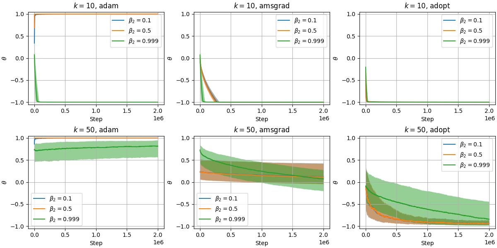

# Toy Problem of ADOPT

Requirements: Python, NumPy, and Matplotlib
(This code was developed by using Python 3.10.15, numpy 2.1.3, matplotlib 3.9.3)

This is an unofficial implementation of toy problem described in [ADOPT paper](https://arxiv.org/abs/2411.02853).

<p align="center"></p>

The figure above can be created by the following command:

```shell
python summary.py data
```

All the necessary data are located in the directory `data`.

## Toy

### Example

```shell
python toy.py --noise 50 --algo adopt
```

### Usage

```
usage: toy.py [-h] [--algo ALGO] [--lr LR] [--beta2 B2] [--noise K] [--steps T]
              [--samples N] [--init P] [--interval I] [--seed S] [--output PATH]

Toy problem

options:
  -h, --help     show this help message and exit
  --algo ALGO    optimization algorithm: adam | amsgrad | adopt (default: adam)
  --lr LR        base learning rate (default: 0.01)
  --beta2 B2     Adam's beta2 parameter (default: 0.999)
  --noise K      constant k controlling the magnitude of gradient noise (default: 10)
  --steps T      number of iterations (default: 2 * 10**6)
  --samples N    number of samples (default: 1000)
  --init P       initial value of the parameter (default: 0)
  --interval I   log interval (default: 1000)
  --seed S       random seed (default: 1)
  --output PATH  output file path (default: output.pickle)
```

## Plot

### Example

```shell
python plot.py output.pickle
```

### Usage

```
usage: plot.py [-h] PATH [PATH ...]

Plot for toy problem

positional arguments:
  PATH        path to output file of toy problem

options:
  -h, --help  show this help message and exit
```

## License

MIT License

&copy; 2024 Takenori Yamamoto
